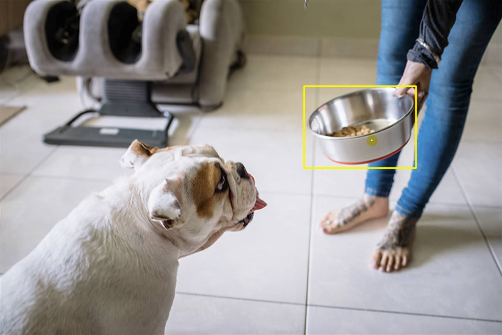
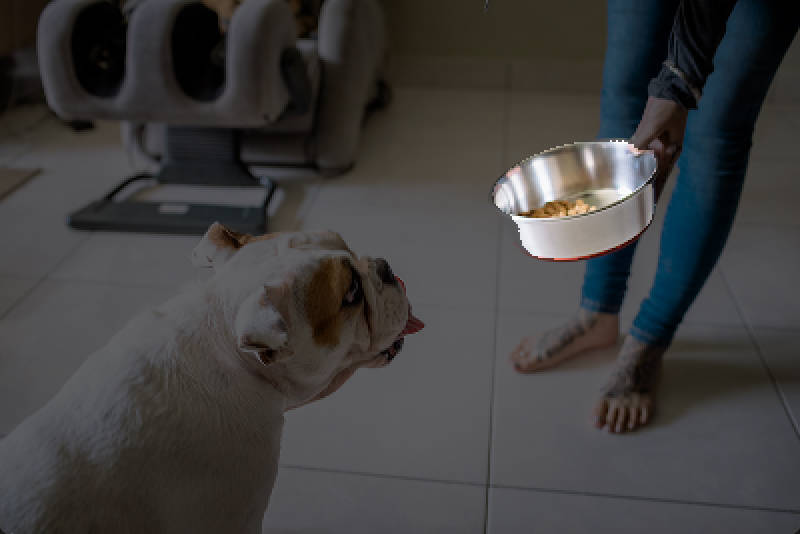

# SegmentAnything-OnnxRunner
| [English](README.md) | [简体中文](README_CN.md) |
<div align="center">
  <div style="display: flex; justify-content: center;">
    
    
    
  </div>
  <p align="center">
    <em>
      <strong>Model</strong> : sam_vit_l_0b3195_encoder.onnx + sam_vit_l_0b3195_decoder ; 
      <strong>Image</strong> : truck.jpg ; 
      <strong>Clickinfo</strong> : [(774,366) , positive] ; 
      <strong>Boxinfo</strong> : [(636,292),(874,454)]</em>
  </p> 
</div>


## 介绍📰
​    SegmentAnything-OnnxRunner 是C++上使用 Meta AI Research 的 SAM onnx 模型的示例。Segment Anything Model (SAM) 根据点或框等输入提示生成高质量的对象蒙版，它可用于为图像中的所有对象生成蒙版。 该存储库用于记录在CPU上运行SAM onnx模型的实验数据。同时，为了提高运行效率，SAM的编码器和解码器在该存储库中被解耦，具体模型下载地址见下方。

## 注意⚠️
* 目前该接口仅支持CPU执行，具体实验数据及使用的设备如下所示，并且该代码仅在 Windows 上受支持，在 Linux 上运行时可能会遇到问题。

## 开发环境🖥️
​    描述仅代表本仓库的开发环境，不代表任何软件版本的限制信息
* Device 1 : Windows 10 Professional / CUDA v11.3 / cmake version 3.26.2 / CPU i5-13600KF
* Device 2 : Windows 11 Home / CUDA v11.7 / cmake version 3.27.1 / CPU i5-13500H

## 快速开始💡
### 构建需求
``` 
# onnxruntime 3rdparty
This repository use onnxruntime-win-x64-1.14.1
# opencv 3rdparty
This repository use opencv4.8.0
# CXX_STANDARD 17
```
### 构建过程
```
# Enter the source code directory where CMakeLists.txt is located, and create a new build folder
$ mkdir build
# Enter the build folder and run CMake to configure the project
$ cd build
$ cmake ..
# Use the build system to compile/link this project
$ cmake --build .
# If the specified compilation mode is debug or release, it is as follows
$ cmake --build . --config Debug
$ cmkae --build . --config Release
```
### 获取模型权重
​    所有的模型在[百度网盘](https://pan.baidu.com/s/1j0z1mHDOshOCcQWwetmFnQ?pwd=ljgr) (code: ljgr)予以提供。

### 启动参数说明
| 参数 | 是否必需 | 参数说明  |
|:------|:----:|:------:|
| --encoder_model_path | ✅ | 存放编码器模型的路径 |
| --decoder_model_path | ✅ | 存放解码器模型的路径 |
| --image_path | ✅ | 待输入demo进行分割的图片的路径 |
| --save_dir | / | 输出分割结果的路径，默认为’output‘，若该文件夹不存在会进行创建 |
| --use_demo | / | 是否使用图形化界面进行SAM分割，默认启用 |
| --use_boxinfo | / | 是否使用框选信息辅助SAM分割，默认不启用 |
| --use_singlemask | / | 是否使用Singmask模型进行SAM分割（不推荐），默认不启用 |
| --keep_boxinfo | / | 是否在多步操作中保留框选信息，默认启用 |
| --threshold | / | IOU 分割阈值，低于阈值的结果将不被保存，默认0.9 |

   范例如下所示:
```
# Run in the build directory
$ Debug/main.exe --encoder_model_path {your_encoder_path} --decoder_model_path {your_decoder_path} --image_path {your_image_path} --use_demo true --use_boxinfo true

$ Release/main.exe --encoder_model_path {your_encoder_path} --decoder_model_path {your_decoder_path} --image_path {your_image_path} --use_demo true --use_boxinfo true
```

### 操作说明
​    根据你的--use_demo选项分为demo模式和cmd模式，以下是一些demo模式下的操作说明，cmd模式直接在控制台中输入坐标及框信息即可
| Operation | Mode | Description |
|:------:|:----:|:------:|
| Mouse Left Button Down | use_demo | 点击鼠标左键捕获点的坐标（x,y），并将positive设置为true，可视化效果为绿色的点 |
| Mouse Right Button Down | use_demo | 点击鼠标右键捕获点的坐标（x,y），并将positive设置为true，可视化效果为红色的点 |
| Keyboard Shift Key + Mouse Left Button Down | use_demo && use_boxinfo | 同时摁下shift和左键实现拖拽获取框信息，box info中包含左上角点和右下角点 |
| Keyboard 'q' or Keyboard 'esc' | use_demo | “退出”, 摁下Q或esc退出分割Segment Anything Onnx Runner Demo |
| Keyboard 'c' or  | use_demo | “继续”, 摁下C将上次输出的mask作为decoder的mask_input继续进行分割 <br />**注意**: 在不摁下C键直接点击时，则不启用mask_input，等价于重新开始单步操作 |
<div align="center">
  <div style="display: flex; justify-content: center;">
    
    
    
  </div>
  <p align="center">
    <em>
      <strong>Model</strong> : sam_vit_l_0b3195_encoder.onnx + sam_vit_l_0b3195_decoder ; 
      <strong>Image</strong> : dog.jpg ; 
      <strong>Clickinfo</strong> : [(600,218) , positive] ; 
      <strong>Boxinfo</strong> : [(466,118),(668,264)]</em>
  </p> 
</div>

## 实验记录🗒️
​    实验设备：i5-13600KF + NVIDIA GeForce RTX 3060（12GB）
​    输入图像分辨率：1920 * 1080 * 3 
​    使用的模型获取地址：[百度网盘](https://pan.baidu.com/s/1j0z1mHDOshOCcQWwetmFnQ?pwd=ljgr) (code: ljgr).
#### 编码器
| 编码器版本 | 模型大小(MB/GB) | CPU耗时(s) | 
| :------------------:| :---------------: | :---------------: | 
| sam_vit_b_01ec64_encoder.onnx          | 342MB | 2.5485 | 
| sam_vit_b_01ec64_encoder-quantize.onnx | 103MB | 2.0446 | 
| sam_vit_l_0b3195_encoder.onnx          | 1.14GB | 6.0346 | 
| sam_vit_l_0b3195_encoder-quantize.onnx | 316MB | 4.1599 | 
#### 解码器
| 解码器版本 | 模型大小(MB) | CPU耗时(s) | 
| :------------------:| :---------------: | :---------------: | 
| sam_vit_b_01ec64_decoder.onnx            | 15.7MB | 0.075 | 
| sam_vit_b_01ec64_decoder_singlemask.onnx | 15.7MB | 0.075 | 
| sam_vit_b_01ec64_decoder.onnx            | 15.7MB | 0.086 | 
| sam_vit_b_01ec64_decoder_singlemask.onnx | 15.7MB | 0.082 | 

## 许可
本项目的发布受MIT许可认证。